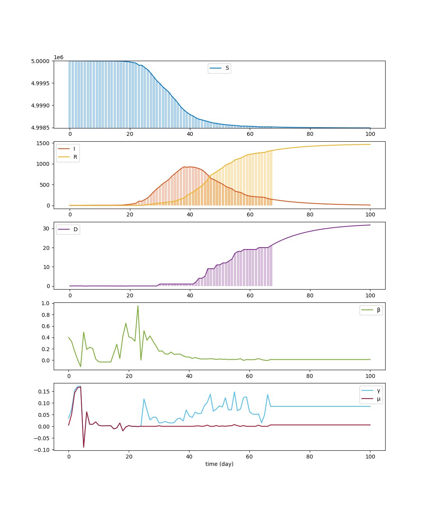

SIRD
====

A Python script to model Covid-19 using the `SIRD model <https://en.wikipedia.org/wiki/Compartmental_models_in_epidemiology#The_SIRD_model>`_.

Install/upgrade
---------------

::

 pip install -U git+https://github.com/ABI-Covid-19/sird.git

Uninstall
---------

::

 pip uninstall -y sird

Use
---

::

 # Import the SIRD module.
 import sird

 # Create an instance of the SIRD model.
 m = sird.Model()

 # Run the model for 100 days (default) and plot its results.
 m.run()
 m.plot()

 # Reset the model, re-run it for 150 days and plot its results.
 m.reset()
 m.run(150)
 m.plot()

 # Generate a movie showing the evolution of the SIRD model throughout time.
 # Note: this requires FFmpeg to be installed.
 m.movie('movie.mp4')

 # Output all the values for S, I, R and D.
 print(m.s())
 print(m.i())
 print(m.r())
 print(m.d())

 # Output the value for S, I, R and D at day 29.
 print(m.s(29))
 print(m.i(29))
 print(m.r(29))
 print(m.d(29))

For the first run, you should get something like:

As for the movie, you should get something like:

